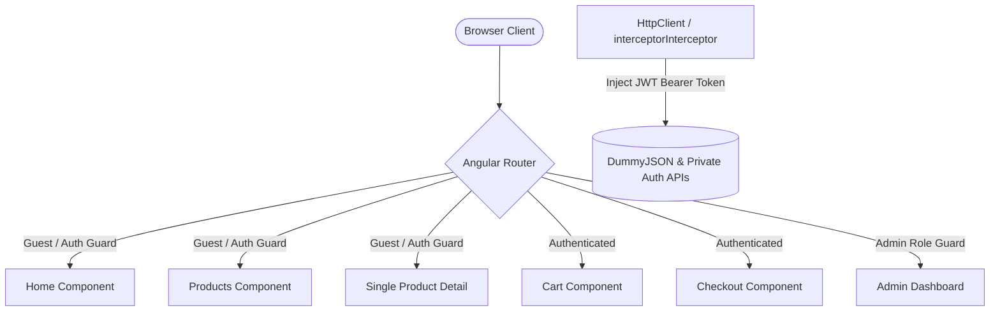

# RainBow Toys

RainBow Toys is a high-fidelity, enterprise-grade e-commerce storefront built with Angular (v20+), optimized for fluid client performance, security, and immediate business monetization. 

### 🌎 Live Demo
**[mega-ecommerce-project.pages.dev](https://mega-ecommerce-project.pages.dev)**

---

## 1. Business Value & ROI
* **Customer Conversion Speed**: Zero-lag product navigation (immediate routing) ensures maximum customer engagement and minimizes drop-offs during product discovery.
* **Granular Access Control**: Administrative tasks (inventory management, dashboard stats) are shielded behind authentication guards to prevent unauthorized modifications.
* **Platform Scalability**: Built with modular component encapsulation and robust HTTP interception, facilitating seamless migration to distributed microservices.
* **Optimized SPA Deployment**: Out-of-the-box support for client-side routing fallback configurations ensures 100% availability on CDN deployments (Cloudflare Pages).

---

## 2. Technical Architecture & Features

### System Diagram


### Core Architecture Specifications
* **State Orchestration**: Custom service-based client states (`serve.ts`) synchronizing inventory selections, carts, and user sessions dynamically, persisted securely in client-side LocalStorage.
* **Access Control & Routing**: Custom guards (`LoginGuard` and `adminGuardGuard`) intercepting transitions to sensitive pages. Client profiles are validated as `user` or `admin` roles, restricting checkout access or administrative panels.
* **HTTP Interceptor System**: Global `HttpInterceptorFn` intercepting all outgoing backend requests to automatically inject Bearer JWT Authorization headers when a token is present, while bypassing generic public routes.
* **Visual Styling & Accessibility**: Implements a curated design system using CSS variables, custom media query breakpoints, and Bootstrap components to ensure a fully mobile-first responsive viewport display.
* **Toast Notification Engine**: Integrated `ngx-toastr` messaging system replacing default browser alert prompts with elegant, non-blocking toast alerts for visual micro-animations (e.g., adding to cart, email newsletter signup).

---

## 3. Tech Stack
* **Framework**: Angular v20+
* **Language**: TypeScript
* **Styling**: Modular CSS + Bootstrap v5
* **Notifications**: ngx-toastr v19
* **Hosting**: Cloudflare Pages (CDN SPA Deployment)

---

## 4. Local Installation & Development

1. **Clone the repository**:
   ```bash
   git clone https://github.com/ZiadtahaM/mega-ecommerce-project.git
   cd mega-ecommerce-project/ecommerce
   ```

2. **Install dependencies**:
   ```bash
   npm install
   ```

3. **Launch local dev server**:
   ```bash
   npm run start
   ```
   Open `http://localhost:4200` to view it in your browser.

4. **Production Build & Redirect Configuration**:
   The build command compiles the Angular application and automatically outputs the SPA client-routing redirect file (`_redirects`) into the production output folder:
   ```bash
   npm run build
   ```

---

## 5. Deployment Configuration (Cloudflare Pages)

The project is configured for deployment to **Cloudflare Pages** using the Wrangler CLI:
```bash
npx wrangler pages deploy dist/ecommerce/browser --project-name=mega-ecommerce-project --branch=main
```

